  
  
  
- [1. 必要软件列表](#1-必要软件列表 )
- [2. 后台开发工具安装](#2-后台开发工具安装 )
- [3. 前台开发工具安装](#3-前台开发工具安装 )
        - [3.1. 修改C:\Windows\System32\drivers\etc\host 文件](#31-修改c/windows/system32/drivers/etc/host-文件 )
        - [3.2. 安装Microsoft Visual Studio 2013](#32-安装microsoft-visual-studio-2013 )
        - [3.3. 将开发服务器共享的project_root文件夹复制到本地](#33-将开发服务器共享的project_root文件夹复制到本地 )
        - [3.4. 安装IFS前台开发插件→IFSApplicationFormsDevelopment](#34-安装ifs前台开发插件→ifsapplicationformsdevelopment )
        - [3.5. 确认安装插件与Microsoft Visual Studio 2013匹配](#35-确认安装插件与microsoft-visual-studio-2013匹配 )
  
  
  
# 1. 必要软件列表
  
* IFSApplicationFormsDevelopment
* IFSDeveloperStudio
* Microsoft Visual Studio 2013（英文版）
  

  
****
# 2. 后台开发工具安装
  
### 安装IFSDeveloperStudio，一路Next安装完毕。
注意事项：
1. 需要先安装Java环境；
2. 由于软件是64位所以要求操作系统为64位。
3. 本次数据库实例名（PROD9）
4. 新建IFS项目，选择客户化项目
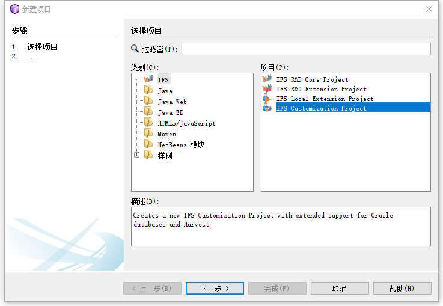
5. 确定project_root，一般也可以由build_home路径代替，注意文件目录
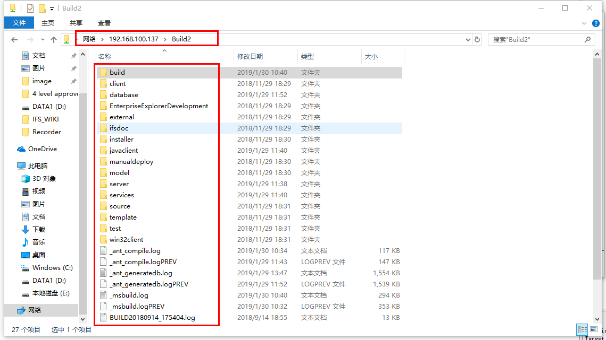
6. 填入项目名称，本地路径以及Build Home地址。Build Home为开发服务器开放的共享文件夹路径，需要先访问共享文件并勾选记录密码。
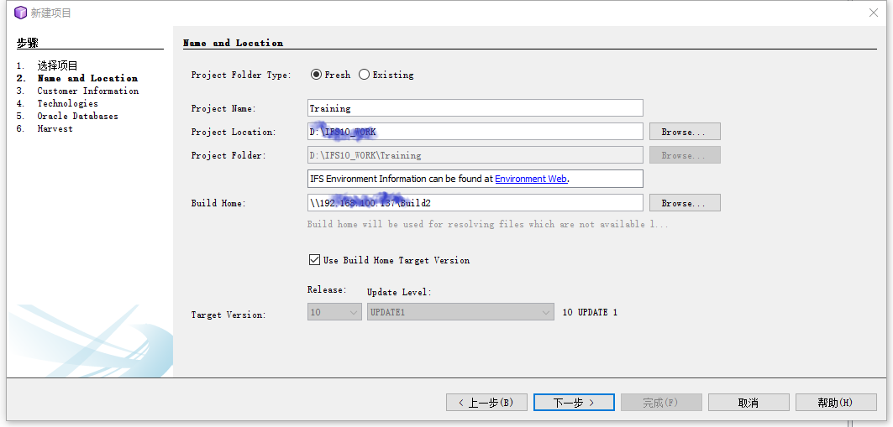
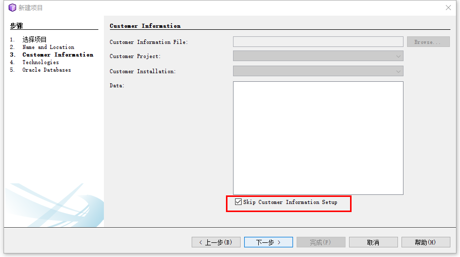
7. 配置webservice信息，如需要再配置，本例学习不做配置
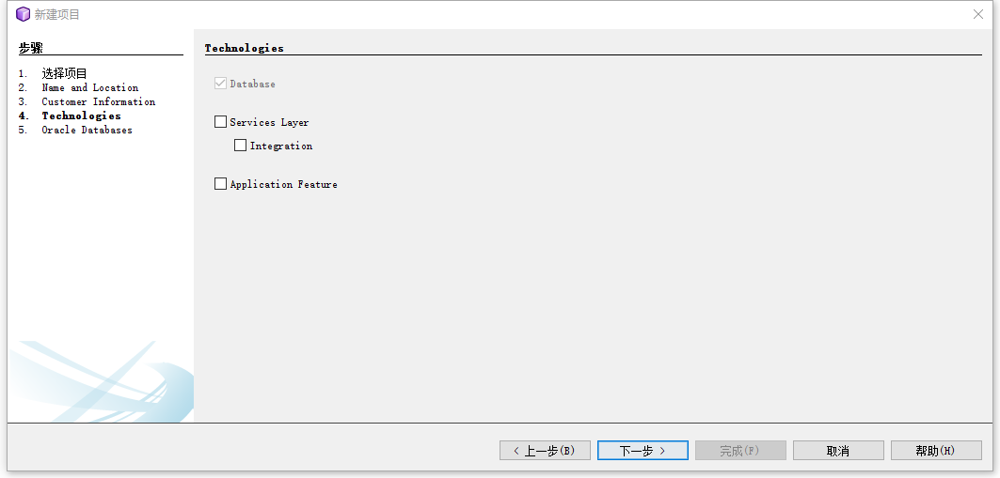
8. 添加数据库连接，可以有多个连接而设定一个为主连接
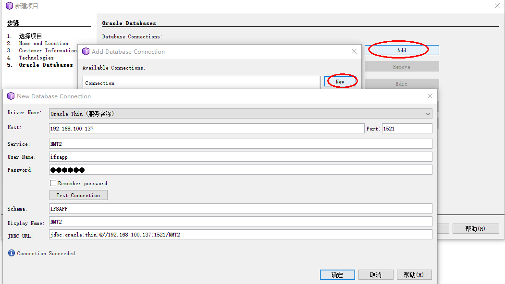
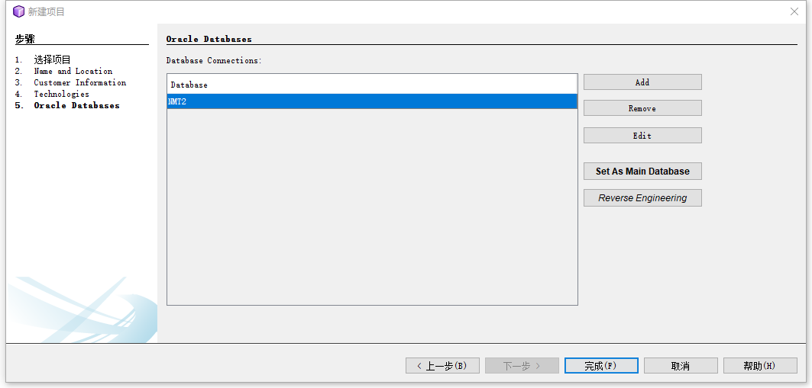
9. 项目添加完成
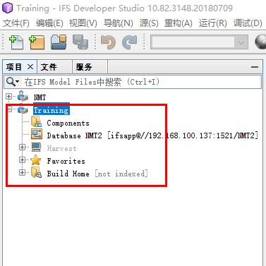

****
# 3. 前台开发工具安装
  
### 3.1. 修改C:\Windows\System32\drivers\etc\hosts 文件
  
将本地计算机hosts文件追加开发服务器的IP、计算机名信息，例如本次追加:192.168.100.137  win-8g8oqsp7hb9

  
### 3.2. 安装Microsoft Visual Studio 2013
  
执行安装文件，一路Next安装完毕
  
### 3.3. 安装IFS前台开发插件→SetupIFSAPFDevelopment100
本地路径选择2.6中配置的IFS项目路径，团队路径选择远程Build Home路径
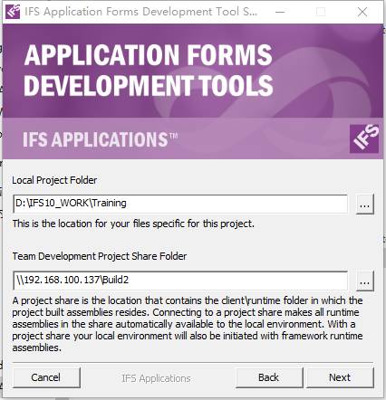
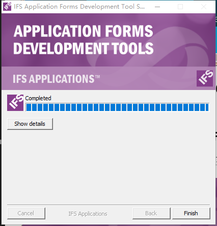

### 3.4. 安装后本地路径多了一些工具以及路径，这些都是IFS开发中需要的
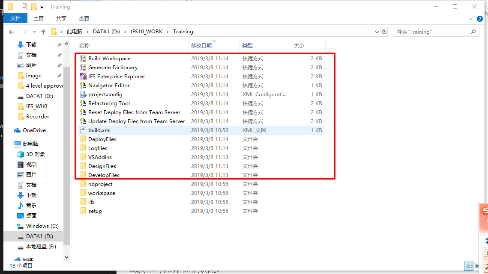

**注意事项：** 
*需要安装``.``NET Framework 4.5.2环境*
  
****
  
# 4.开发代码获取
1. 删除workspace文件夹并从Git仓库中克隆整个workspace目录即可，前台开发的依赖工程需要到Build Home共享服务器中复制到需要的位置
如果使用GitHub Desktop，File->Clone a repository->URL
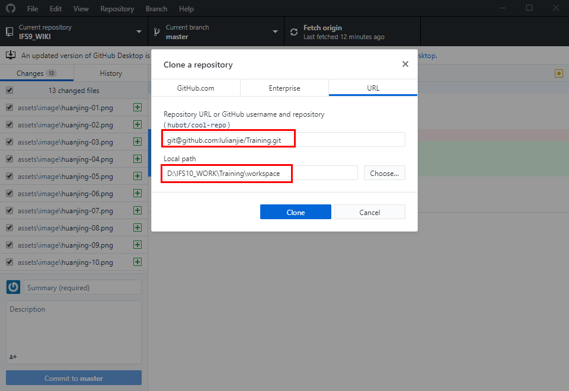
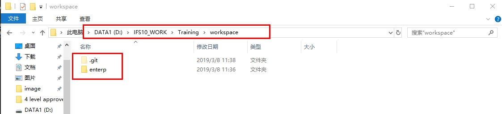
2. 复制Build Home中的Base层代码到本地路径
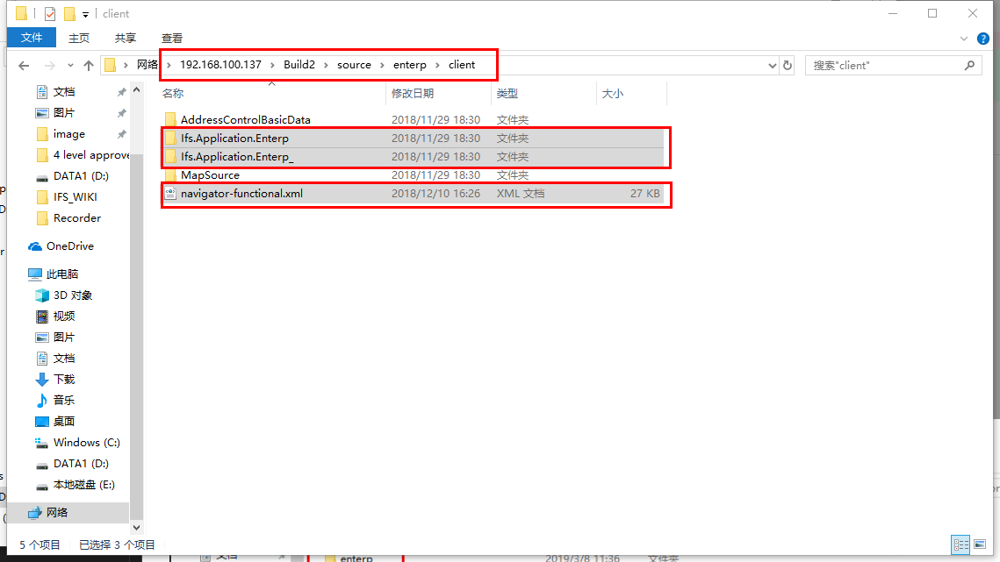
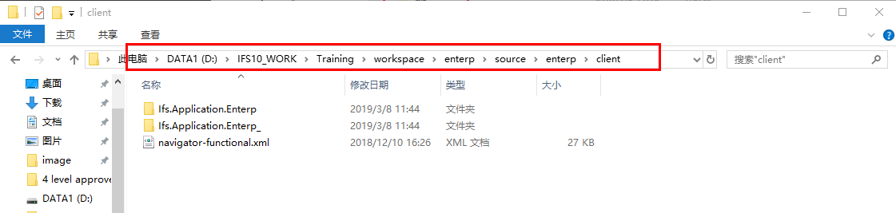
3. 进入下级路径打开VS工程
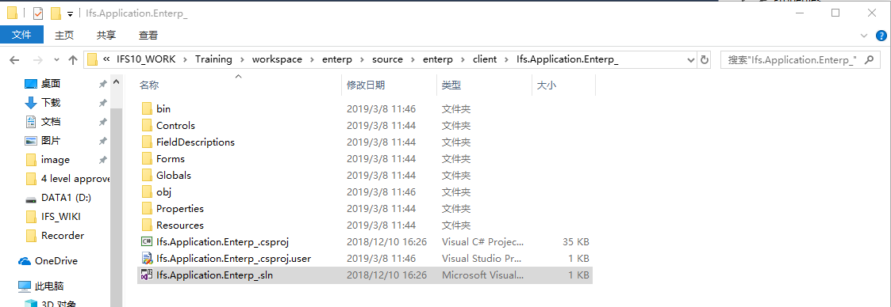
4. 弹出以下报错无视，这是自动更新，不在内网所以报错
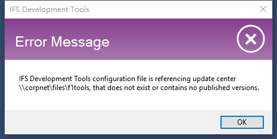
5. 编译工程，对打开的Core层工程右键Custpmize this project，弹出框选择Cust层，Ok
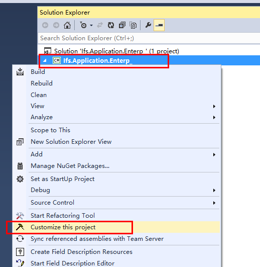
6. 所有的客户化代码请在新建出的Cust层内进行开发，如下
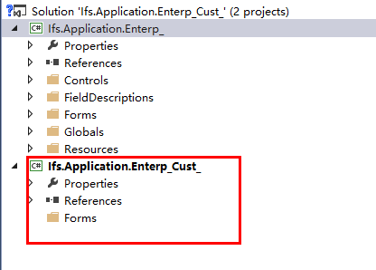