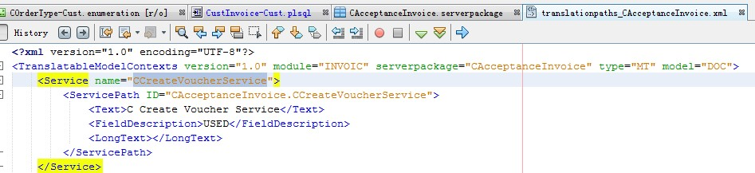
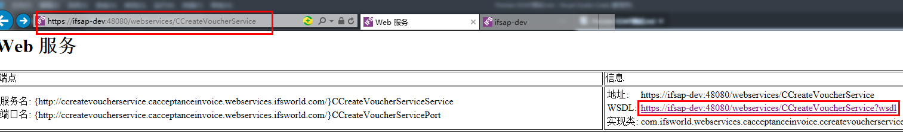
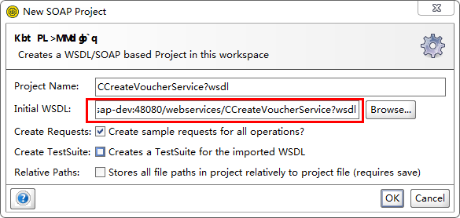
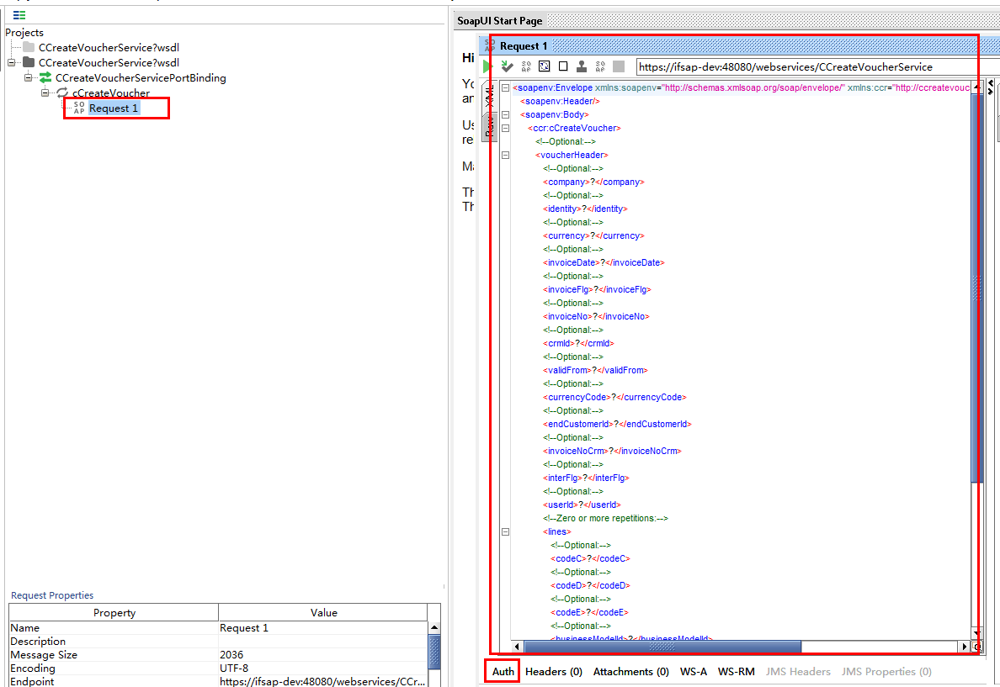

1. 复制serverpackage中的Service name

2. 复制到IFS组成WSDL

3. 启动SoapUI软件,Create a new SOAP project

4. 双击Request 1,右侧弹出Request 1画面,在下方Auth填入认证信息后即可运行

5. Auth--Add New Authorization--Basic--OK

# serverpackage字段类型不要用数字型，有坑