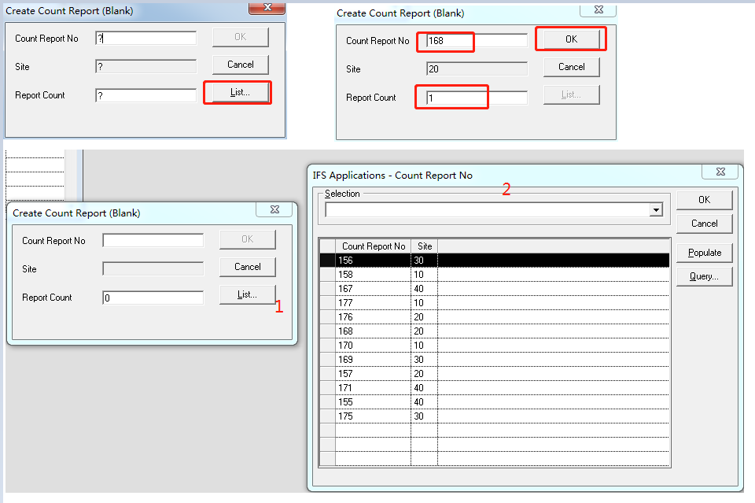
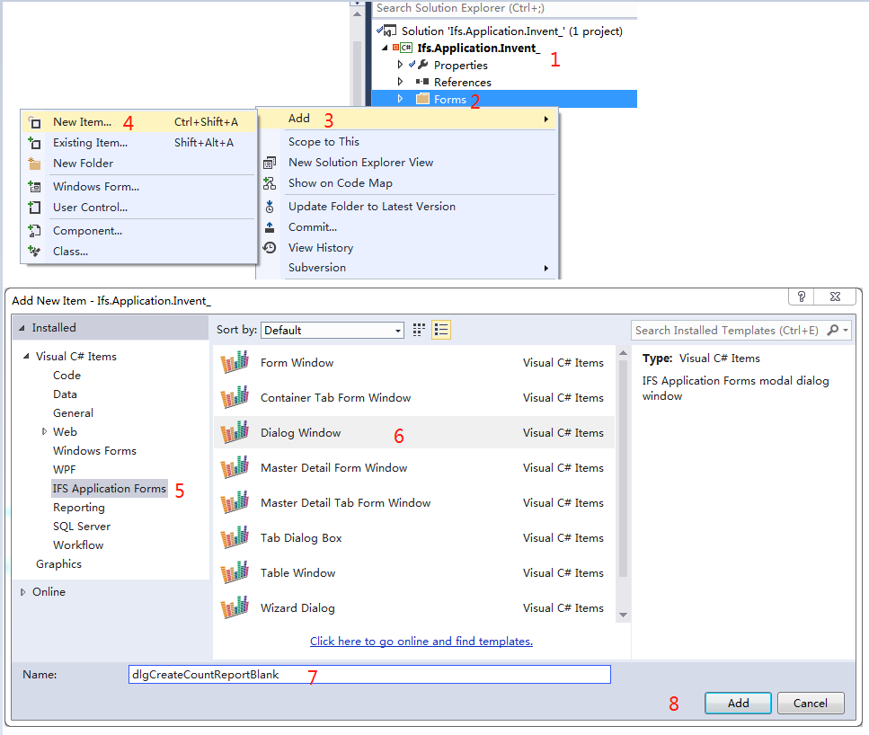
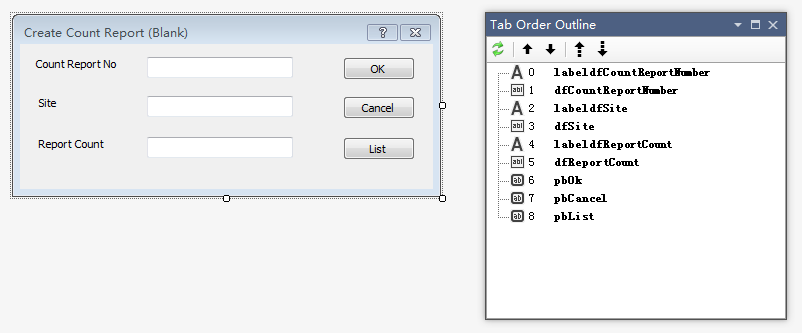
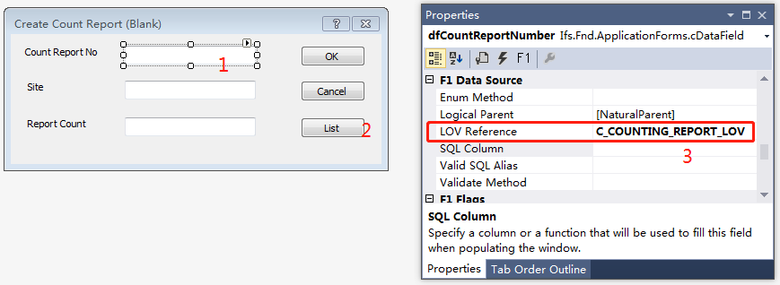
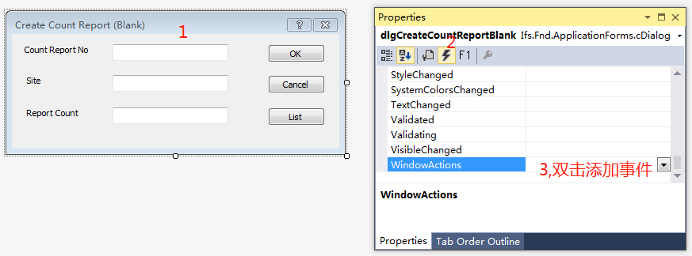
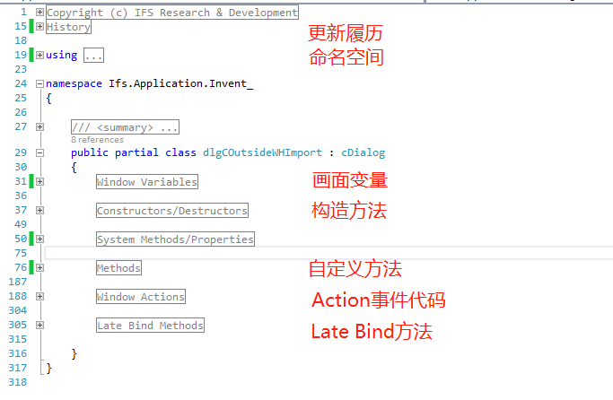

# 需求样例
1. 画面表示如图所示；
2. Count Report No可以通过输入框录入，可以通过List弹出页面进行选择；
3. 当Count Report No能够在系统中找到时，Site自动显示对应的值；
4. 点击Ok后调用水晶报表（本例不具体实现，以假代码代替）；
5. 当Count Report No有值并且Report Count>0的时候Ok按钮可用；
6. Cannel按钮一直可用，点击后对话框关闭；
7. 当光标处于Count Report No的输入框中时List按钮可用，其他情况不可用。

_____
# 开发步骤
1. 打开所属工程，新建dlg画面；

2. 删除自带的commandOk和commandCancel按钮以及代码
2. 替换已有的命名空间引用
```
using System.Windows.Forms;
using Ifs.Fnd.ApplicationForms;
using PPJ.Runtime;
using PPJ.Runtime.Windows;
```
2. 写入画面的历史变更记录
```C#
#region History
/// Date    By      Notes
/// ------  ------  ------------------------------------------------------------------------------------------------------
/// 170411  ErFelk  Bug 135123, Modified WhenNumeric() by adding row edited flag to the While loop.
/// ----------------------------------------------------------------------------------------------------------------------
#endregion
```
3. 新增画面控件，调整画面布局，画面标题又Text属性修改；

4. cBackGroundText控件必有属性为(nae)和Text，例如：(name)=Count Report No,Text=Count Report No
5. cDataField控件必有属性为(name)，例如：(name)=dfCountReportNumber,如果想让值列表可用则需要设置LOV Reference属性

6. 其他常用属性说明：
   Enable：是否可以选定，无法选定则内容也无法复制、修改
   Readonly：知否只读，可以选定复制
   Visible：是否可见
7. 画面和需要的事件的cDataField增加WindowsAction事件
   在画面或者字段的属性画面中点击Events，找到WindowsAction，双击内容区域则增加事件调用
   
8. 重写cDialog类的LateBind接口，一般重写vrtUserMethod方法即可
```C#
        #region Late Bind Methods

        /// <summary>
        /// Virtual wrapper replacement for late-bound (..) calls.
        /// </summary>
        public override SalNumber vrtUserMethod(SalNumber nWhat, SalString sMethod)
        {
            return this.UserMethod(nWhat, sMethod);
        }
        #endregion
```
9. 实现上一步中被调用的UserMethod方法，例如本例代码如下：
```C#
        public new SalNumber UserMethod(SalNumber nWhat, SalString sMethod)
        {
            switch (nWhat)
            {
                //可用性检查逻辑 METHOD_Inquire
                case Ifs.Fnd.ApplicationForms.Const.METHOD_Inquire:
                    //OK按钮可用性逻辑
                    if (sMethod == "Ok")
                    {
                        return !(Sal.IsNull(dfCountReportNumber) || int.Parse(dfReportCount.Text) > 0);
                    }
                    //Cancel按钮可用性逻辑
                    else if (sMethod == "Cancel")
                    {
                        return true;
                    }
                    //List按钮可用性逻辑
                    else if (sMethod == "List")
                    {
                        hWndFocus = Ifs.Fnd.ApplicationForms.Int.PalGetFocus();
                        return Sal.SendMsg(hWndFocus, Ifs.Fnd.ApplicationForms.Const.PM_DataItemLov, nWhat, 0);
                    }
                    return false;

                //执行调用逻辑 METHOD_Execute
                case Ifs.Fnd.ApplicationForms.Const.METHOD_Execute:
                    //OK按钮执行逻辑
                    if (sMethod == "Ok")
                    {
                        //点击OK按钮调用的方法需要自己实现，本例中略过
                        if (PressOk())
                        {
                            return Sal.EndDialog(this, Sys.IDOK);
                        }
                        return false;
                    }
                    //Cancel按钮执行逻辑——关闭当前画面
                    else if (sMethod == "Cancel")
                    {
                        Ifs.Fnd.ApplicationForms.Var.DataTransfer.Reset();
                        return Sal.EndDialog(this, Sys.IDCANCEL);
                    }
                    //List按钮执行逻辑，调用标准List窗体
                    else if (sMethod == "List")
                    {
                        Sal.SendMsg(hWndFocus, Ifs.Fnd.ApplicationForms.Const.PM_DataItemLov, nWhat, 0);
                        Sal.SetFocus(hWndFocus);
                    }
                    else
                    {
                        return false;
                    }
                    break;
            }

            return false;
        }
```
10. 补充步骤7中添加的WindowsAction具体实现方法
```C#
        private void dlgCreateCountReportBlank_WindowActions(object sender, WindowActionsEventArgs e)
        {
            switch (e.ActionType)
            {
                case Sys.SAM_Create:
                    this.dlgCreateCountReportBlank_OnSAM_Create(sender, e);
                    break;

                case Ifs.Fnd.ApplicationForms.Const.PM_DataItemEntered:
                    this.dlgCreateCountReportBlank_OnPM_DataItemEntered(sender, e);
                    break;
            }
        }
```
```C#
        private void dlgCreateCountReportBlank_OnSAM_Create(object sender, WindowActionsEventArgs e)
        {
            e.Handled = true;
            Sal.SendClassMessage(Sys.SAM_Create, Sys.wParam, Sys.lParam);
            Sal.CenterWindow(this);
        }
```
```C#
        //改事件调用自行实现的注册按钮方法InvestigateButtonStates()
        private void dlgCreateCountReportBlank_OnPM_DataItemEntered(object sender, WindowActionsEventArgs e)
        {
            e.Handled = true;
            this.InvestigateButtonStates();
        }
```
11. 实现本例中增加的3个按钮画面注册到窗体中方法
```C#
        public virtual SalNumber InvestigateButtonStates()
        {
            using (new SalContext(this))
            {
                pbOk.MethodInvestigateState();
                pbList.MethodInvestigateState();
                pbCancel.MethodInvestigateState();
            }
            return 0;
        }
```
12. 解决本例中当Count Report No选择数据后自动带出Site值的处理逻辑
```C#
        public virtual SalBoolean ValidateSite()
        {
            if (Sal.IsNull(dfCountReportNumber))
            {
                dfSite.Text = Ifs.Fnd.ApplicationForms.Const.strNULL;
            }
            else
            {
                //调用函数将Site进行赋值
                string stmt = @"{0} := &AO.C_Counting_Report_API.C_Get_Contract({1} IN)";
                if (!(DbPLSQLBlock(stmt, dfSite.QualifiedBindName, dfCountReportNumber.QualifiedBindName)))
                {
                    return false;
                }
            }
            return true;
        }
```
13. 如果遇到带入参有其他画面调用的dlg画面，则需要在ModalDialog方法内增加入参，参考已有例子或者开发手册
```C#
        public static SalNumber ModalDialog(Control owner, SalNumber nYear, SalNumber nPeriod, SalString sContract)
        {
            dlgInventoryValueRep dlg = DialogFactory.CreateInstance<dlgInventoryValueRep>();
            dlg.nYear = nYear;
            dlg.nPeriod = nPeriod;
            dlg.sContract = sContract;
            SalNumber ret = dlg.ShowDialog(owner);
            return ret;
        }
```
14. 将画面注册到Navigator或者写由其他画面调用
```C#
    dlgInventoryValueRep.ModalDialog(Ifs.Fnd.ApplicationForms.Int.Explorer.ExplorerForm, nStatYearNo, dfnStatPeriodNo.Number, dfsContract.Text);
```
30. 最终，一个dlg画面的代码部分大概是如下层次结构的

_____