## 目的  
使用模板可以通过减少维护的数据量来加快创建记录的进程，用于有相似数据的情况。  
## 创建模板  
单击Part Master Data——Inventory Part导航文件夹  
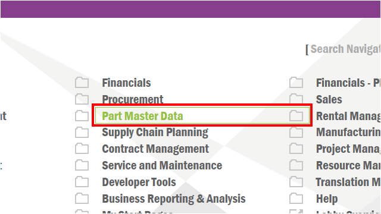  

打开Inventory Part画面，单击工具条New按钮，快捷键**F5**  
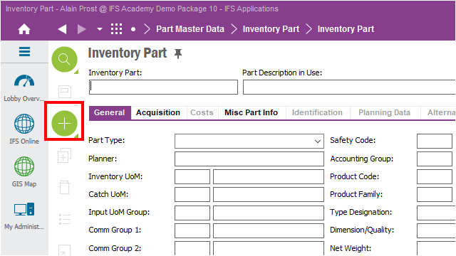  

创建一个模板，使用PCS（件）作为其库存度量单位并将其保存为模板。  
单击Inventory UoM栏，输入<label style="color:red">PCS</label>  
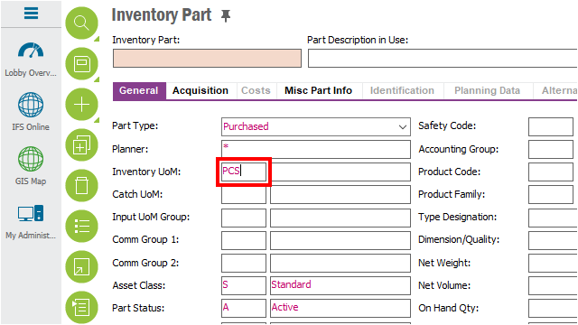  

单击菜单项**Save**下拉按钮。  
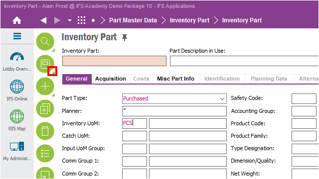  

单击**Save as Template**按钮  
  
输入Title并保存  
## 使用已有的模板  
单击菜单项**New**下拉按钮  
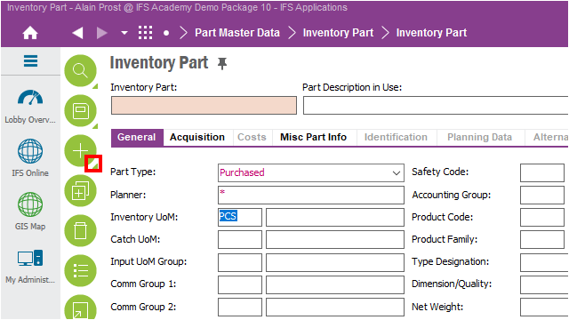  

单击**New From Template**按钮  
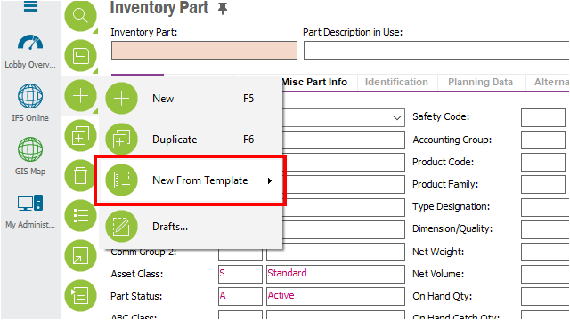  

单击**PCS**模板  
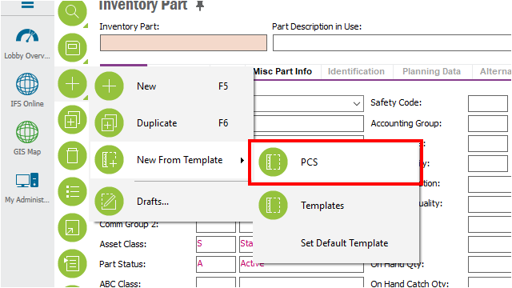  
  
## 将模板设置为默认值  
单击导航文件夹**My Administration**。  
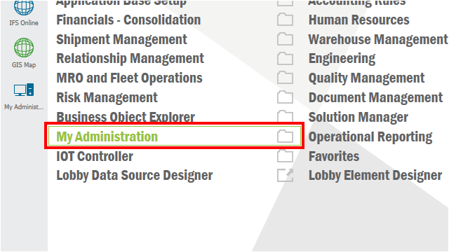  

单击导航项**Templates**。  
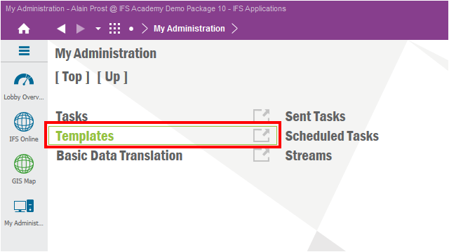  

“模板”页面显示您创建和保存的所有模板。 这些信息都保存在个人配置中。  
单击箭头可以打开或者折叠组  
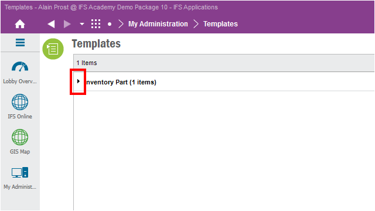  

对**PCS**点击右键，单击**Set as Default**  
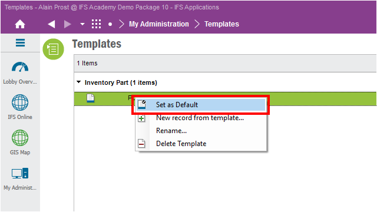  

点击**Recent Screens**按钮切换画面，快捷键**Ctrl + Space**  
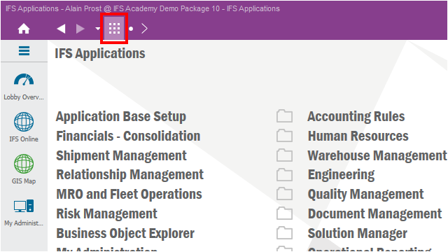  

单击**Inventory Part**画面  
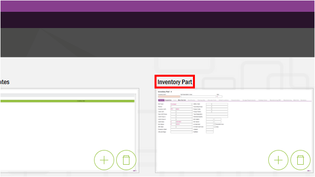  

单击工具条**New**按钮  
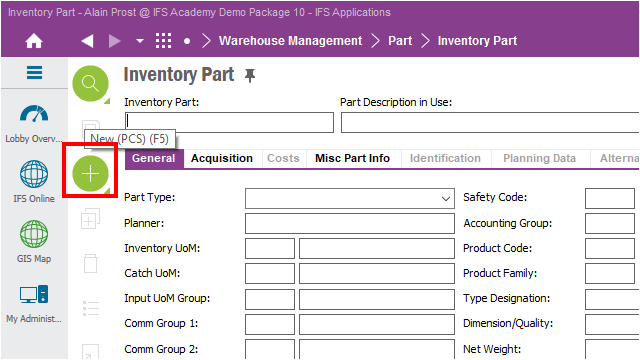  

“PCS”中的库存件现在是默认模板  
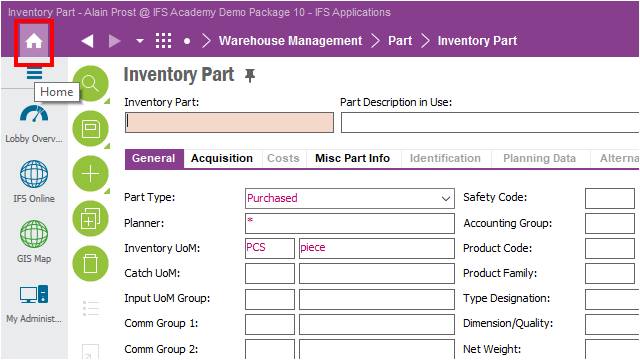