## 目的  
   当您开始创建对象但由于缺少信息而无法完成时，草稿非常有用。  
## 创建和使用草稿  
   * 单击导航器按钮，快捷键**Ctrl + Shift + F**  
   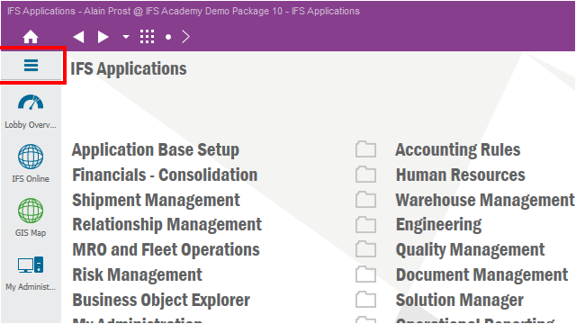  
   --------------------  
   * 导航到Part Master Data, Inventory Part, Inventory Part   
   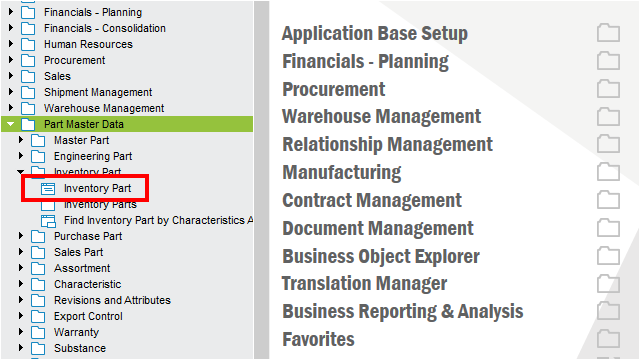  
   ---------------------  
   * 点击新建按钮，快捷键**F5**  
   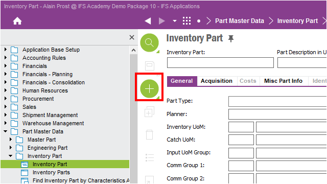  
   --------------  
   * 单击Inventory UoM属性  
   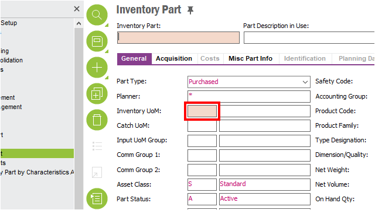  
   -------------  
   * 单击工具条List of Values选项，快捷键**F8**  
   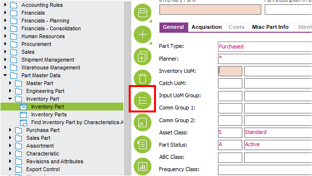  
   ------------------  
   * 双击选择 UoM = mm  
   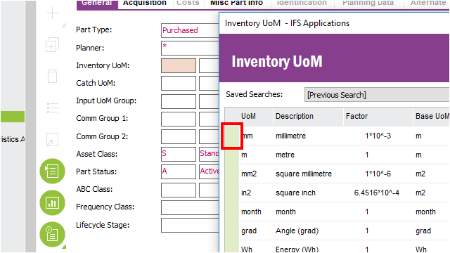  
   ------------------  
   * 现在我们有一个部分填充的数据窗口。 我们把它保存为草稿。  
   单击菜单项下拉Save按钮。  
   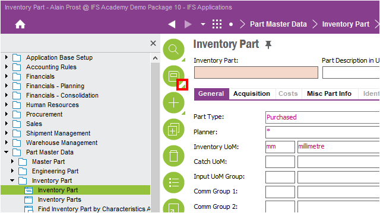  
   ------------------  
   * 单击菜单项Save as Draft，快捷键**Shift + F12**  
   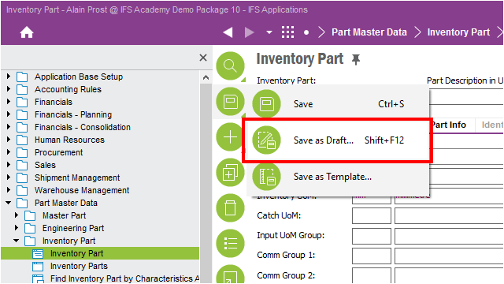  
   ------------------  
   * 填写Title、Totes值并点击OK按钮  
   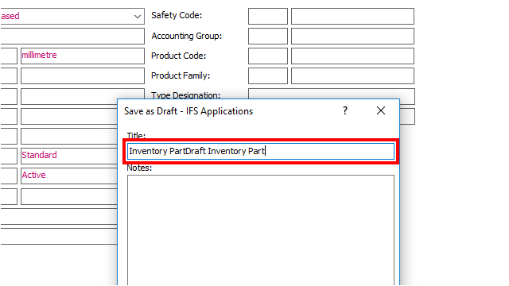  
   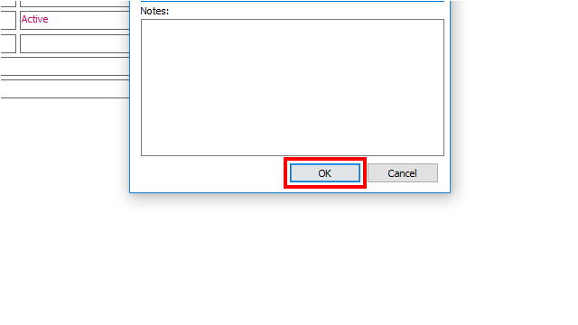  
   ------------------  
   * 草稿创建了一个位于任务列表中的任务，直到您准备好所有信息并且完成它。  
   Task 面板位于屏幕底部的功能区窗格中。  
   单击功能区 Task。  
   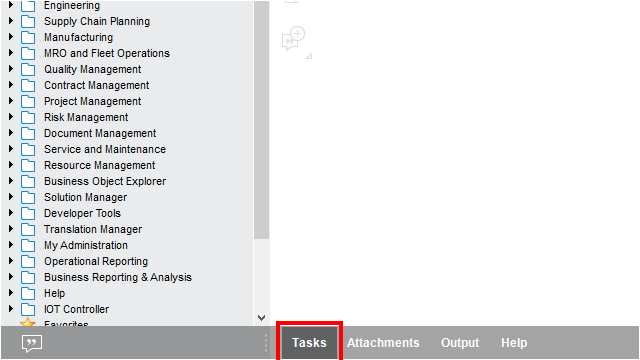  
   ------------------  
   * 单击蓝色带下划线的超链接  
   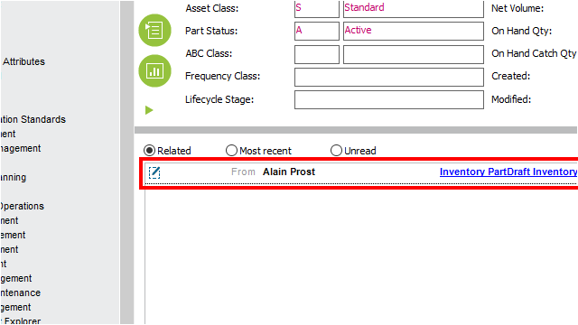  
   ------------------  
   * 编辑完全信息并且保存  
   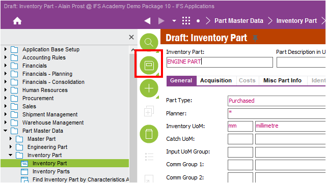  
   ------------------  
   * 单击Refresh按钮  
   保存记录后，任务将从任务列表中删除。  
   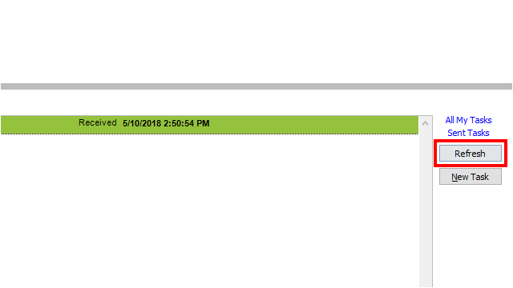  
   ------------------