## 目的
定制一个自己个性化需要的开始页面
## 创建我的开始页面
单击导航画面中的**My Start Pages**  
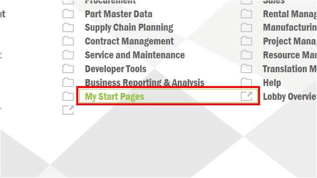  

单击**New**按钮  
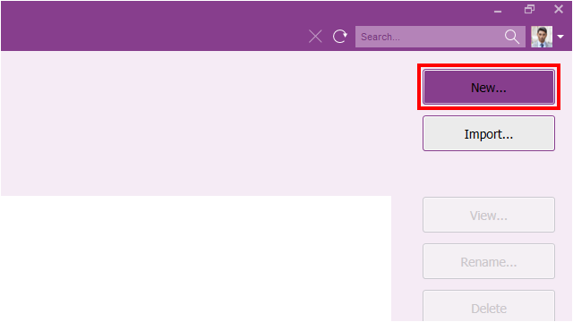  

输入名称并单击**OK**按钮  
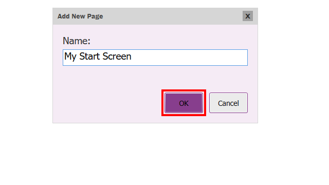  

单击**My Start Screen**，单击**View**按钮，或者双击**My Start Screen**进入到该页面  
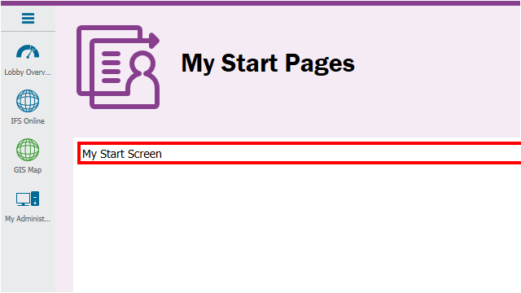  
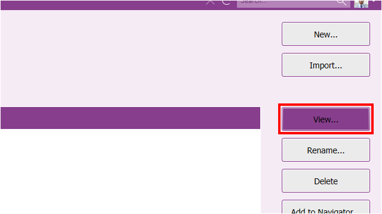  

单击**Lock**按钮解锁页面，解锁后可编辑  
  

单击**Add**按钮  
  

在该画面中你可以添加一系列IFS定制的功能，例如标题、文本、已保存的搜索（根据条件数据结果动态变化）、报表、已选择的数据集（数据固定不变）、链接、全文搜索  

单击**Add Title**  
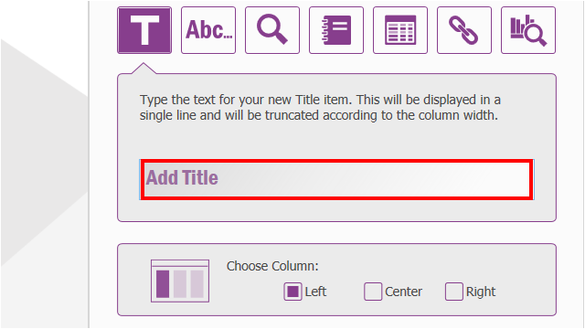  

输入信息**Selections**  
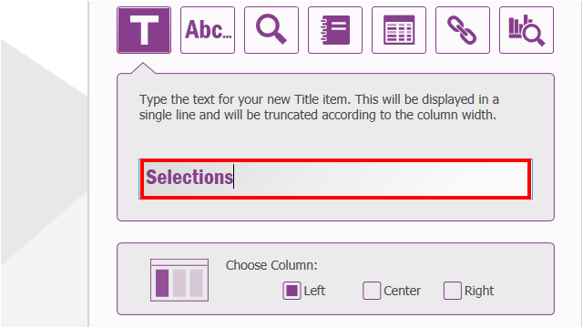  
你可以选择该按钮的布局位置  

单击**Add**按钮  
  

新标题显示在起始页面上。  
“添加项目”对话框保持打开状态。  

单击**Selection**按钮  
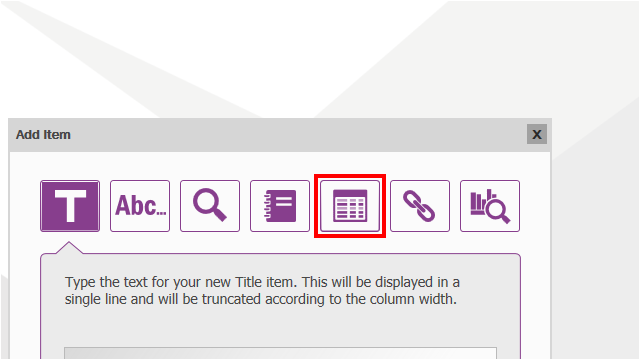  

这将在下拉列表中显示所有已保存的**Selection**  
单击**drop down** 按钮  
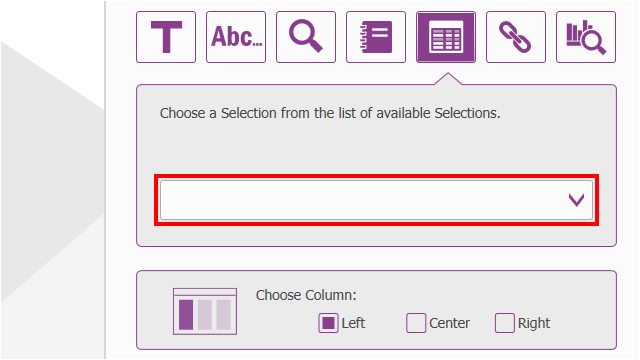  

单击选择**Critical Customers**选项  
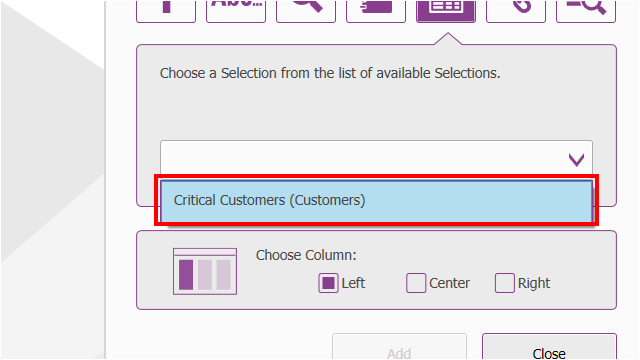  

单击**Add**按钮  
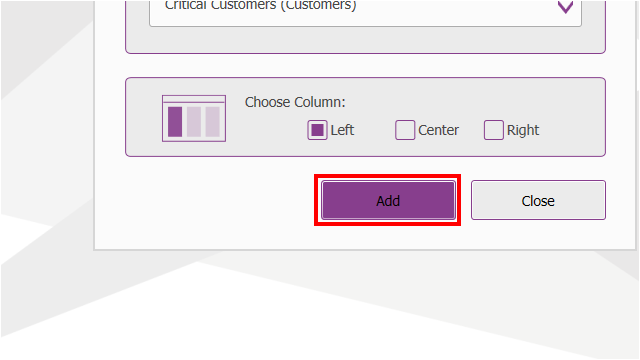  

添加其他功能对象  

单击**Lock**按钮结束编辑  
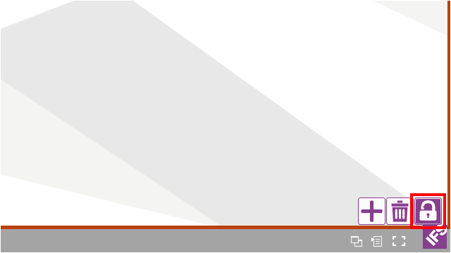  

新的起始页已创建。  
您现在可以通过单击相关选项来访问链接的各种画面。 这可以使终端用户节省时间、降低系统使用难度。  

单击**Critical Customers**数据选择项按钮  
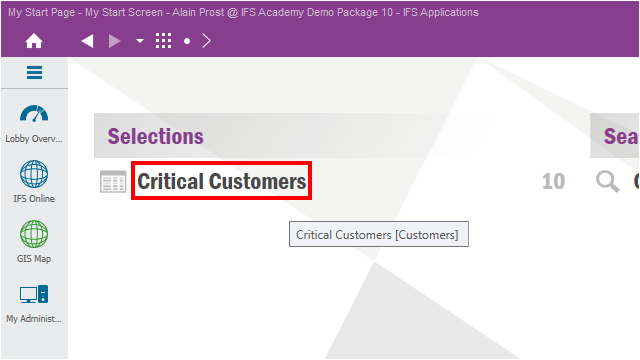  

画面跳转到已经设置好的数据选择项画面，并且呈现设置好的数据，单击**Back**按钮返回起始页，快捷键**Alt + Left**  
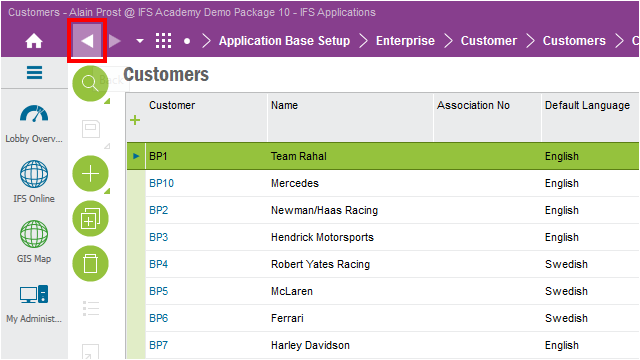  

单击**Cancelled Customer Orders**数据查询按钮  
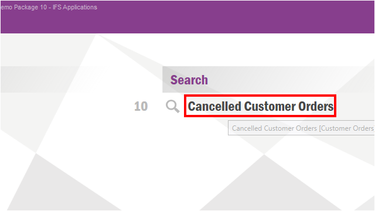  

画面跳转到已经设置好的数据查询画面，这里的数据结果集是可变的，单击**Back**按钮返回起始页，快捷键**Alt + Left**  
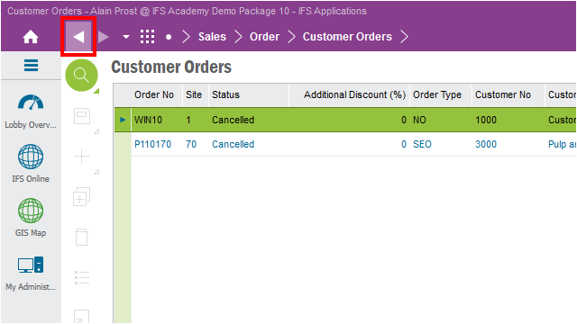  

