## 概述
粘滞便笺使您可以与同事共享信息或作为提醒。 它们附加到对象或详细的交易页面，任何可以看到它的人都可以添加或删除文本。  
粘滞便笺通常用于共享临时信息，但由于其“随意”使用，不应将其用于业务关键信息。  

## 创建粘滞便笺  
单击导航文件夹**Sales**
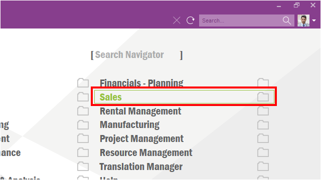  

单击导航文件夹**Order**  
单击**Customer Order**项  
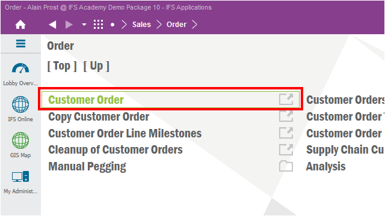  

单击工具条**Search**项，快捷键**F3**  
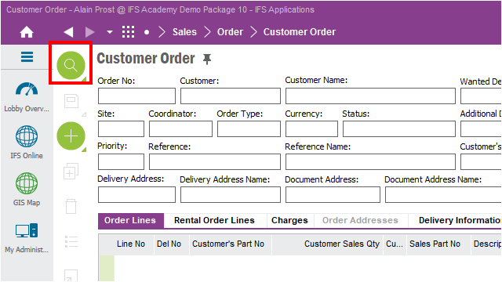  

输入订单号并检索  
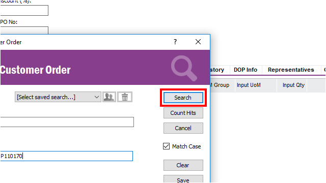  

单击工具条项**Notes**  
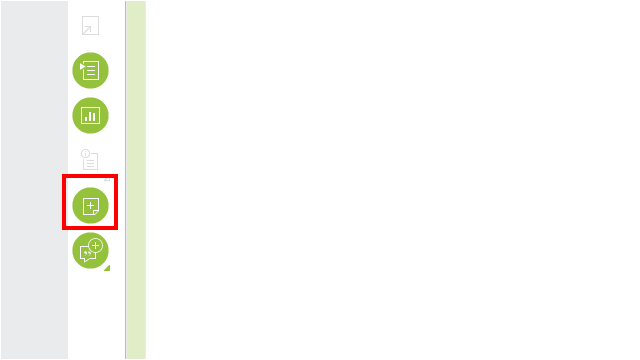  

一个空白便签就创立了  
在便签中填入内容  
  

可以在便签上添加文本，图像和链接，现在我们添加一个名为John的电子邮件链接。  
右键单击文本框。  
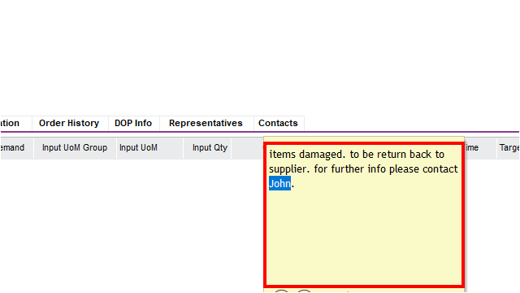  

单击上下文菜单项**Insert Hyperlink**  
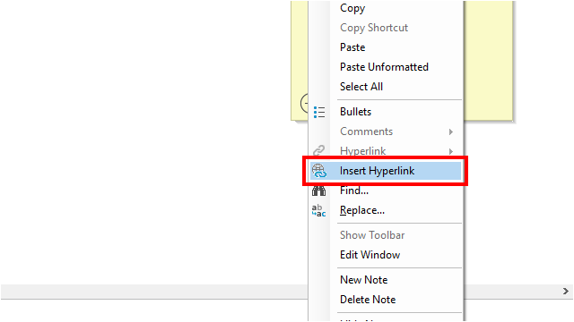  

单击**E-mail Address**按钮  
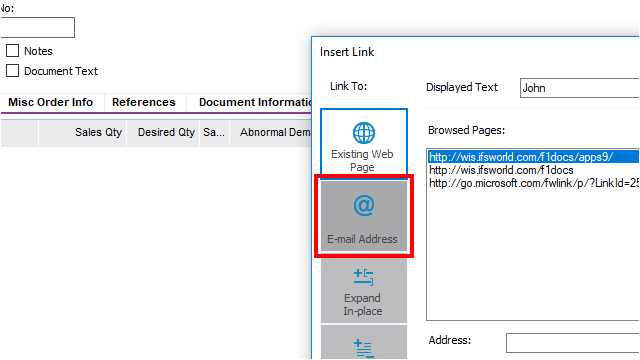  

输入**E-mail Address**并单击**OK**按钮  
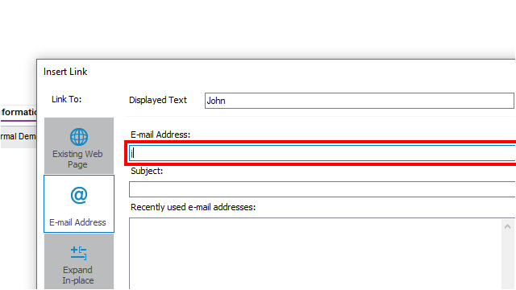  
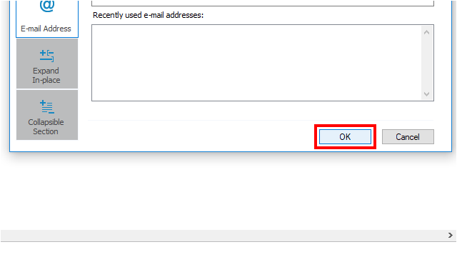  

让我们检查链接是否按预期工作，点击John链接  
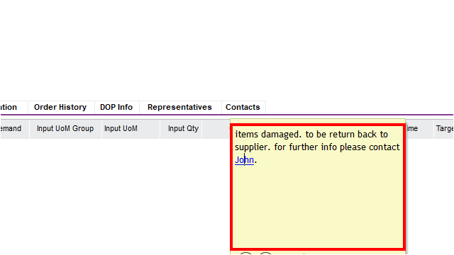  

邮件客户端正确打开并且收件人栏被自动输入  
  

如何删除已创建的粘滞标签  
单击**Delete**按钮  
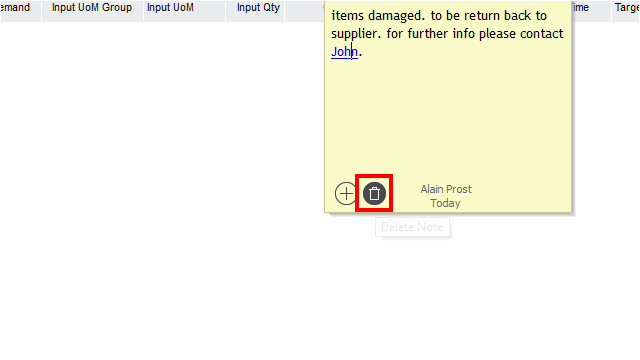  

弹出对话框单击**Yes**按钮  
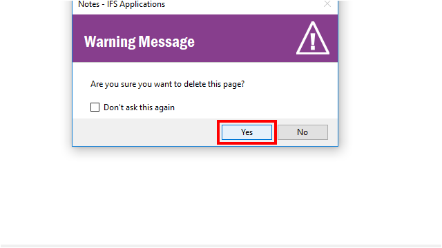  