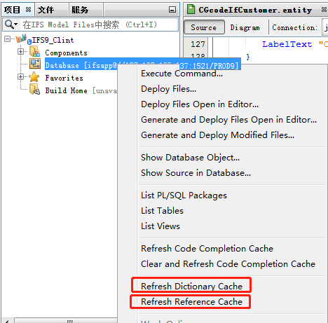
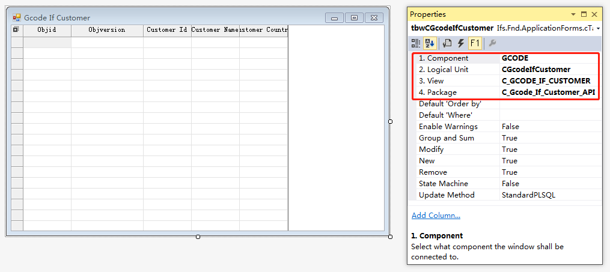
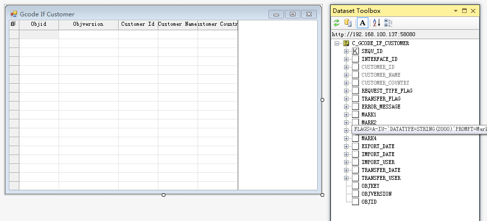
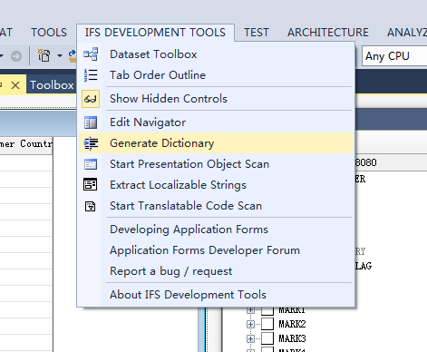
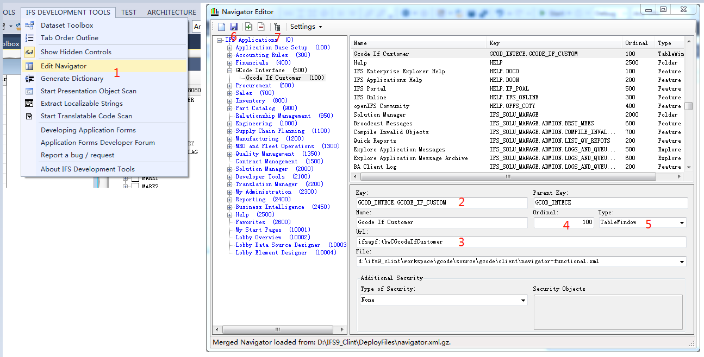
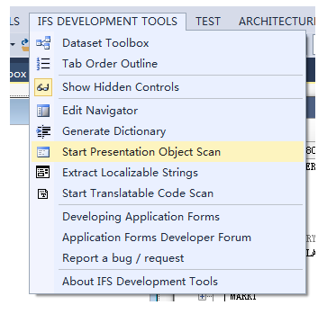
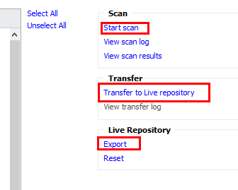
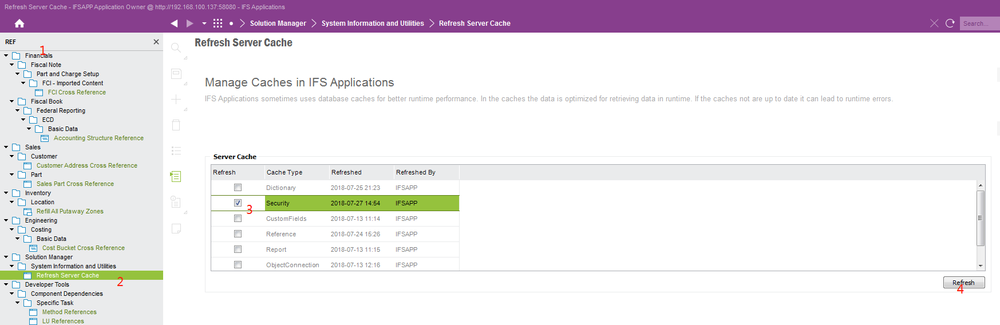
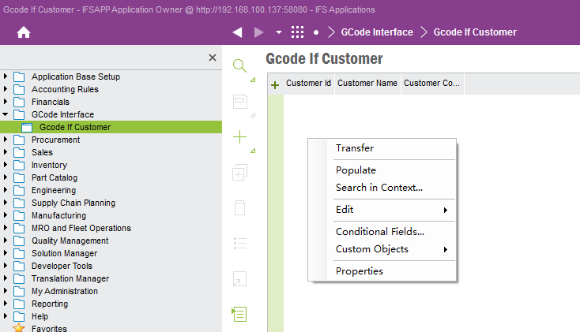

1. Refreshed server dictionary/cache

20. Create form an connected the client to view, pkg & module

30. Add the data field/columns;

40. Bulid Solution
41. Generated dictionary.

42. Add new item to navigator(make sure to select correct navigator functional XML file),Save and deploy navigator.

50. Scan presentation object & Transfer to Live repository & export ins file to database

60. Refresh security cache

70. Restart the client & test.
