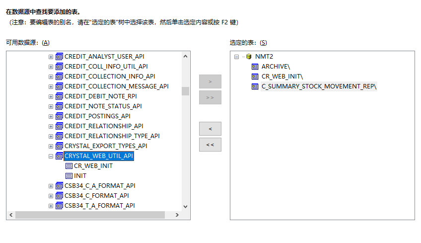
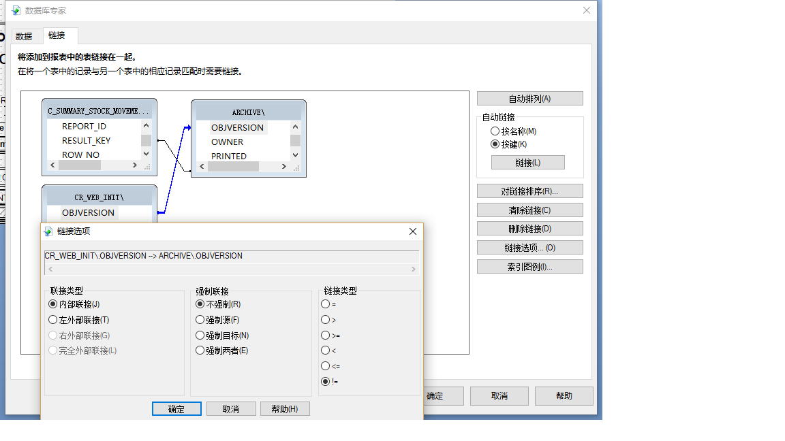

* 安装IFS提供的水晶报表开发软件SAP Crystal Reports 2013 v14.1.6.1702 - SP6 update
* 下载oracle12c 32位客户端文件，如果不是32位客户端则水晶报表数据库选项中没有Oracle Server
* 配置PATH，TNS_HOME环境变量，指向32位客户端
* 运行水晶报表注册表文件InvalidAliasCharList_CR2013，运行后视图可以以“\”符号结尾

# 常用Reference #
属性         |     Reference值
-----        |------
Company      | COMPANY_FINANCE 
Contract     |USER_SITE_COMPANY_LOV(COMPANY)
VendorNo     |SUPPLIER
BuyerCode     |PurchaseBuyer
AuthorizeCode  |OrderCoordinator
OrderNo      |PURCHASE_ORDER
BuyerCode     |PurchaseBuyer
Location|INVENTORY_LOCATION11(CONTRACT)

# 条件写法
Report_SYS.Parse_Parameter(pol.company,company_) = 'TRUE'

# 修改报表名，保存自动生成rdf文件
```
codegenproperties {
    GenerateRdf                  "yes";
    TitleText                    "Material Issuance Report(RP019)";
}
```

# 水晶报表内数据库
* 水晶报表需要连接的数据库对象：ARCHIVE视图和CRYSTAL_WEB_UTIL_API.CR_WEB_INIT以及业务报表创建的REP视图

* 对象连接关系
